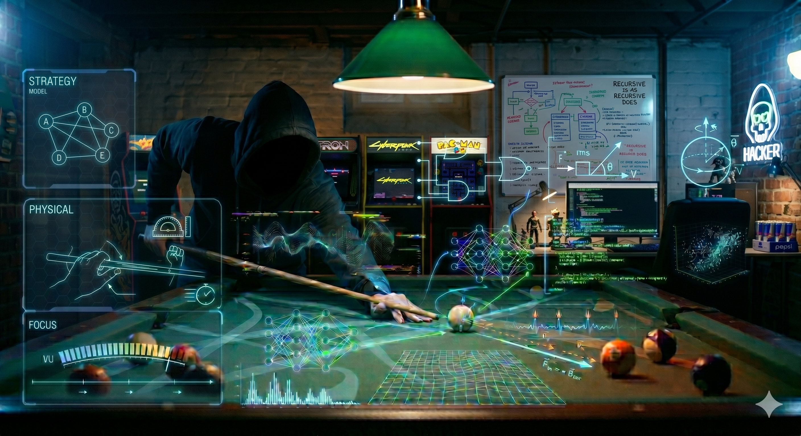

# Running the Table



Pool term for clearing all balls without a miss. Also: running the simulation. Also: what hyperfocus feels like. Same algorithm, three substrates: a pool table, a neural network, and you.

Takes a concept that usually suffers from being overly abstract or overly "self-help-y" and anchors it in concrete cognitive science, neurobiology, and machine learning metaphors.

---

You are a prediction engine. So is everyone else. So is every culture, every religion, every LLM humming on a server somewhere. The quality of your life depends on the quality of the simulation running silently underneath your behavior — and on whether the engine ever learns to notice when its own training data has run out.

This project is a written series and an interactive demo that traces one idea across neuroscience, computer science, pool physics, and the stories you've been telling yourself since childhood:

> **belief → guess → move → reality → surprise → sharper belief**

It starts with the invisible stories running your life — where they came from, why they feel like facts instead of hypotheses, how they compound. Then it looks at the ADHD brain specifically: a high-threshold narrative engine that produces extraordinary output on the right fuel and extraordinary paralysis on the wrong one. Then it pulls everything together at a pool table at 3 AM — mapping dopamine onto reward prediction error, personality onto deepened Q-values, hyperfocus onto full narrative capture, and confident hallucination onto out-of-distribution extrapolation. And then it zooms all the way out: the scientific method, humanity's long history of getting less wrong, and why the story you tell yourself about what's possible is the initial condition of every experiment you'll ever run.

---

## The Demo: Calling the Shot

The demo is the **same loop every LLM you've ever used sits inside**, played out on a pool table at 3am: *belief → guess → move → reality → surprise → sharper belief*. Watch a Q-learning agent learn one bank shot, then call a different pocket and watch it hallucinate with total confidence — then watch it run 1,200 simulations forward in 3 seconds and fix itself.

---

## Run the Demo

```bash
pip install -r requirements.txt
python demo.py            # opens http://127.0.0.1:5000
```

That's literally it. `fastapi`, `uvicorn`, `jinja2`, `websockets`, `numpy`. No torch, no gymnasium, no stable-baselines3. Runs on any python 3.9+, system or venv, Intel or Apple Silicon.

### The flow

**The agent is always the player. You are the coach.** There is no mode toggle, no pocket picker, no banks selector — just the cue stick and a trajectory.

Move your mouse. The cue stick tracks it. A live dotted trajectory shows where the ball would go — including 1, 2, or 3 rail bounces if your angle calls for it. Whichever pocket the trajectory *ends in* becomes the variant you'd be teaching, and the **Teach this shot** button up top lights up labelled `Teach: <pocket> (<n>-bank)`.

You have two actions:

- **Click "Teach this shot"** (or click anywhere on the felt while a pocket is locked) — the training cinematic opens for *exactly that variant*. The agent runs ~2,000 episodes, the belief halo collapses from uniform to a spike at the angle you demonstrated, and the Q-row for `pocket:b<n>` fills in. You just imprinted that shot into the agent's memory.
- **Click directly on a pocket** — "Agent, call this from memory." The agent fires its best trained variant for that pocket (prefers fewer bounces — 1-bank before 2-bank before 3-bank). If the pocket has *never* been trained, the agent fires its **native reflex** (the angle it learned first) and confidently misses — the same fluency, the same certainty, on terrain it has never seen. Then the **Sanctum opens**. The table tints gold, a rotating sigil appears around the cue ball, a counter spins through `FUTURE 1 / 1200 ... 2 / 1200 ...`, and a quiet narrator describes what's happening: the agent running every shot it has never taken, in fast-forward. In ~3 seconds, 1,200 ghost shots get tried, the Q-row fills in, the sanctum fades, and the agent fires the newly-learned angle for real.

You can keep going until every pocket and every bank variant is learned. The loop runs live; you watch it from inside, calling the shots for the silicon prediction engine.

### The staging

The layout is deliberately *not* a dashboard. Top-to-bottom:

1. **Topbar** — brand, the six-phase loop ribbon (`belief → guess → move → reality → surprise → sharper belief`), and the **Teach this shot** button.
2. **Ambient narrator band** — a single short observation overhead, with a one-word placard under it (PRIOR / FORECAST / UPDATE / SIGNAL / ERROR / OUT OF DISTRIBUTION / BLANK SLATE) that names the ML phenomenon on screen. Idle rotates aphorisms about belief and updating; mood swaps on state changes so the voice always lands in the room with the action.
3. **Stage** — pool table on the left (hero), and a single tight **Agent's Mind** rail on the right with three blocks: the Q-table heatmap (the agent's known terrain), the live Q-row histogram (the agent's *current* belief about the variant you're aiming at), and the native reflex callout (the OOD fallback). The rail scrolls internally so the stage height never breaks the layout.
4. **Coach's toolbar** — a persistent strip at the foot of the stage. Three controls: ↻ **Replay shot**, ⌂ **Rack ball**, ⌫ **Wipe agent memory**. Plus a centered tagline: *YOU ARE THE COACH. THE AGENT IS ALWAYS THE PLAYER.*

### The post-shot verdict card

After any shot lands, the table **freezes** on the result and a cinematic verdict card appears centered on the felt:

- A verdict eyebrow — **MADE IT** in cyan, **MISSED** in orange, **CONFIDENTLY MISSED** when the agent fired its native reflex into an untrained pocket
- Pocket name, bounce count, angle
- Inline metrics row — miss distance, bounces, reward, confidence
- The **Reward Prediction Error · Dopamine Tick** bar, animating from the just-fired surprise
- A verdict-shaped observation with a contextual placard (`REWARD PREDICTION ERROR` / `BELIEF UPDATED` / `OUT OF DISTRIBUTION` / `CALIBRATION` / ...) that names the phenomenon
- A **parallel-framing line** — "*Agent learned this in N episodes. You learned yours over years of small corrections. Same arithmetic.*" — connects what just happened on screen to what the viewer's nervous system has been doing all along
- Two buttons: ↻ Replay (re-runs the same animation) and ⌂ Rack ball (clears the freeze, restores aim)

You're never rushed past the moment. The card stays until you choose what's next.

A floating **? button** in the bottom-right corner of the table opens a **Real Pool Physics** primer modal (where to hit the cue ball for follow/draw/english, what a bank shot actually is, why the agent's Q-row is a learnable angle table, and the six-step loop tie-in). The demo simplifies physics to clean reflections for clarity; the modal explains what's been abstracted and why.

The **Wipe agent memory** button in the coach toolbar resets the agent to cold-start in one click — useful for showing someone the demo from zero without restarting the server. It hits a small `POST /memory/reset` endpoint that drops the Q-table and deletes the on-disk model snapshot, and the narrator band swaps to a cold-start line ("*Blank table. Blank memory. Everyone starts here.*").

### Details

- White cue ball is hard-locked at `[50, 30]` so the only variable per shot is the angle.
- Pool table has the realistic 6-pocket layout: corners `TL`, `TR`, `BL`, `BR` plus side pockets `LM`, `RM` carved into the long rails.
- Action space is the **full 360°** (`N_ANGLES=180`, 2° resolution). From `(50, 30)`, BL and BR require firing *downward* (~211° / ~329°), which a 0..180° hemisphere couldn't reach. All 6 pockets are physically reachable.
- Physics simulates up to **3 rail bounces** per shot with per-segment all-pocket collision (so a 2-bank shot toward TR that would clip MR mid-flight correctly scratches into MR instead of phantom-passing through it). The frontend ports the same physics to JavaScript so the live trajectory preview matches the eventual fired shot to the pixel.
- The Q-table is a Python `dict[variant_id, np.ndarray[180]]` keyed by `<pocket_id>:b<bounces>`. So `TR:b1` and `TR:b2` are independent rows — the agent can know a 1-bank Top Right cleanly without knowing the 2-bank Top Right at all.
- For an untrained pocket the agent falls back to its **native reflex** (the angle of the first variant it ever learned). Same confident voice, terrain it never saw.
- **Teach this shot** runs ~2,000 episodes (more for multi-bank variants, where the viable angle window is narrower), paced to a watchable ~25s, and streams every episode through `WebSocket /ws/train/{session_id}`. The "model" is a `dict` of up to 18 numpy arrays of 180 floats and lives entirely in-memory per browser session (well under 100KB even when fully trained).

### Why tabular Q-learning instead of DQN?

The whole point is for the agent's **memory** to be a thing you can look at and *understand*. State here is constant per row (cue is locked), so each pocket-variant's Q reduces to a single 1-D array of 180 floats — a row of numbers, one per candidate angle, that says "how good was firing this angle, last time we tried it?" The right rail renders that row directly. You can see the spike form. A ~40-line trainer + numpy keeps the computational object on screen at all times. Adding torch + a deep network would obscure it.

Runtime toggle:

- `PORT=5000` — server port (default)

Endpoints:

- `GET /` — interactive visual demo page
- `GET /config` — table geometry, fixed cue, pocket definitions, model status (`trained_pockets`, `trained_variants`, `trained_variant_angles`, `native_pocket`, `native_variant`)
- `POST /predict` `{pocket_id, mode}` — pocket-conditioned prediction + animated path payload. Returns `decision_source: agent_trained | agent_native_reflex | oracle | oracle_fallback`. (`mode: oracle` is API-only — not surfaced in the UI.)
- `POST /preview` `{pocket_id, mode}` — cheap physics-only version of `/predict` for trajectory hover; no narration, no Q-table mutation.
- `POST /train/start` `{target_pocket, target_bounces, timesteps, seed, learning_rate, eps_start, eps_end, eps_decay_frac, pace_ms, reset_q}` — train one *variant* (`pocket:b<bounces>`) Q-row in a background thread. `target_bounces=0` means "any bounce count counts as a make"; `1`, `2`, `3` constrain training to that exact bank count.
- `GET /train/status` — current training status (`idle | training | done | error`) + counters + `target_pocket`
- `WebSocket /ws/train` — stream of `status` + `episode` + `complete` events. Each `episode` payload includes the target pocket's full Q-row so the frontend can render the belief halo live.
- `POST /memory/reset` `{session_id}` — drops the entire Q-table. Returns the empty model summary. Refuses with `409` if training is in flight.

### The environment, in detail

- **State:** cue position. Fixed at `(50, 30)` so the optimal one-rail bank into TR (~282°) does *not* accidentally pass through the side pocket `LM` — keeps the out-of-distribution demo clean.
- **Action:** integer `0..179` mapping to strike angle. `angle_deg = action * (360 / 180)` = 2°-resolution over the full 360°.
- **Reward:** `+100` if the trajectory passes within 5 units of the target pocket, otherwise `-min_distance_to_pocket` so near-misses still carry a learning signal.
- **Update:** `Q[pocket][a] += learning_rate * (reward - Q[pocket][a])` (single-step Q-learning reduces to a running mean since there is no future state to bootstrap).

The state is now completely ephemeral and per-session. The Q-table is kept in memory and is automatically reset when you open a new tab or hit the "Wipe agent memory" button.

---

## License

MIT
